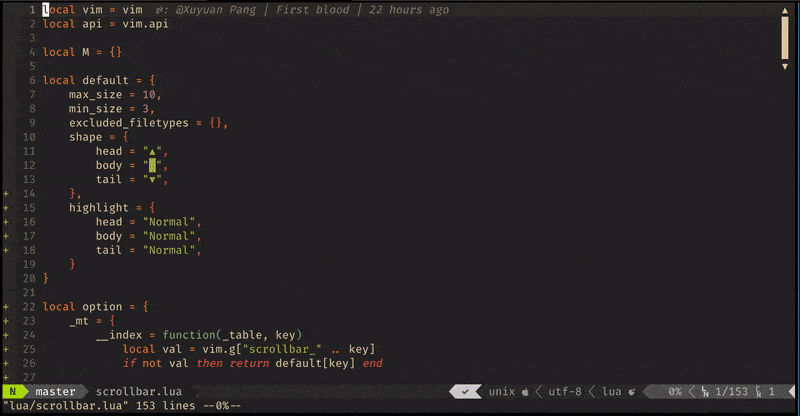

# scrollbar.nvim
[](https://github.com/Xuyuanp/scrollbar.nvim/actions?query=workflow%3ACI)
[](https://opensource.org/licenses/Apache-2.0)
[](https://github.com/Xuyuanp/scrollbar.nvim/graphs/contributors)

scrollbar for neovim(nightly)



## Installation

Just use your favorite plugin manager. e.g. vim-plug:

```vim
Plug 'Xuyuanp/scrollbar.nvim'
```

## Startup

This plugin provides only two `lua` functions, `show` and `clear`. The following config is recommended.

```vim
augroup ScrollbarInit
  autocmd!
  autocmd CursorMoved,VimResized,QuitPre * silent! lua require('scrollbar').show()
  autocmd WinEnter,FocusGained           * silent! lua require('scrollbar').show()
  autocmd WinLeave,FocusLost             * silent! lua require('scrollbar').clear()
augroup end
```

**NOTE:** `clear` is NOT `disable`. To disable it, call `clear`, then remove all the autocommands.

## Options

See in doc `:h Scrollbar.nvim`.

## Similar Projects

* [minimap.vim](https://github.com/wfxr/minimap.vim) by @wfxr
